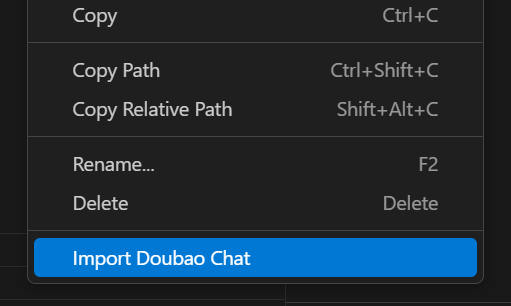

# doubao-chat-extracter README

This is the README for extension "doubao-chat-extracter". 

## Features

This extension does the following:
 - import doubao chat to vscode

like this:


## Requirements

```
    "axios": "^1.4.0"
```

## Dev
welcome to contribute and fork me
**[Github](https://github.com/jack-base/doubao-chat-extracter)**

**Enjoy!**
